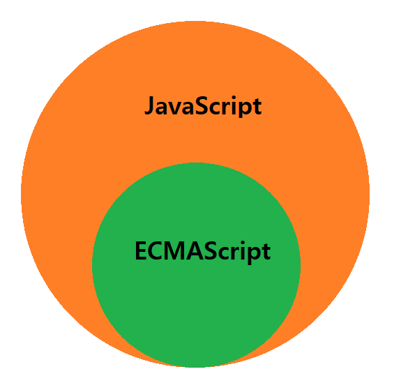
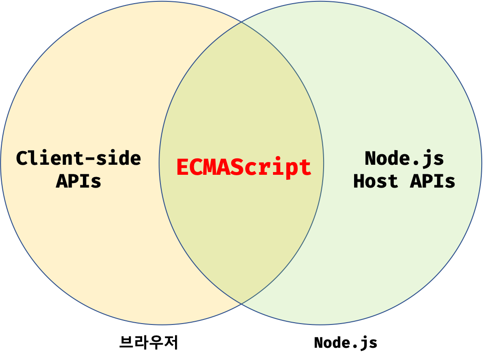

# 자바스크립트의 탄생

```
💡 JavaScript 의 배경
```

- 1995년, 웹 브라우저 시장을 지배하고 있던 `넷스케이프 커뮤니케이션즈(Netscape com-munications)`의 `보조적인 기능을 수행`하기 위해 도입한 `경량 프로그래밍 언어`
  - 이것이 브레던 아이크(Brendan Eich) 가 개발하였던 `자바스크립트`
    
- 1996년 3월, 웹 브라우저인 `넷스케이프 내비게이터 2`에 탑재되었고, `모카(Mocha)`으로 명명되었으며, 그해 9월 `라이브스크립트(LiveScript)` 로 이름이 바뀌었다가, 12월에 `자바스크립트(JavaScript)` 으로 최종 명명되었다.

> ❗ 이때 자바스크립트의 파생 버전인 `JScript 가 출시`되어 `대립관계가 형성`된다.
<br>

# 자바스크립트의 표준화

```
💡 JavaScript 와 JScript 의 경쟁
```

- 마이크로소프트는 JScript를 `인터넷 익스플로러 3.0`에 탑재하여, 이 때문에 `JScript 와 JavaScript` 가 `표준화되지 못하고 적당히 호환`이 되었다.
  - 기업의 시장 점유율을 높이기 위해 마이크로소프트가 경쟁적으로 추가
 
> ❗ 이로 인해 브라우저에 따라 웹 페이지가 정상적으로 동작하지 않는 `크로스 브라우징 이슈`가 발생
<br>

```
💡 ECMA 와 JavaSCript
```

- JavaScript 는 이러한 `파편화를 방지하기 위해` 모든 브라우저에서 정상적으로 동작하는 `표준화된 자바스크립트`를 `ECMA 인터내셔널`에 요청하였다.

> ❗ 그 이후 ECMA에 의해 `ECMAScript`라 불리는 `표준화된 자바스크립트`가 출현하였다.
<br>

```
💡 ECMAScript 의 버전 & 특징
```

| 버전                   | 특징                                                                                                                                                                                                              | 출시 연도 |
| ---------------------- | ----------------------------------------------------------------------------------------------------------------------------------------------------------------------------------------------------------------- | --------- |
| ES1                    | 초판                                                                                                                                                                                                              | 1997      |
| ES2                    | ISO/IEC 16262 국제표준과 동일한 규격을 적용                                                                                                                                                                         | 1998      |
| ES3                    | 정규 표현식, try...catch                                                                                                                                                                                           | 1999      |
| `ES5`                  | HTML5와 함께 출현한 표준안, JSON, strict mode, 접근자 프로퍼티 ,프로퍼티 어트리뷰트 제어 ,향상된 배열 조작 기능(forEach, map, filter, reduce, some, every)                                                              | 2009      |
| `ES6(ECMAScript 2015)` | let/const, 클래스, 화살표 함수, 템플릿 리터럴, 디스트럭처링 할당, 스프레드 문법, rest 파라미터, 심벌, 프로미스, Map/Set, 이터러블 , for - of, 제너레이터, Proxy, 모듈 import/export                                       | 2015      |
| ES7(ECMAScript 2016)   | 지수(\*\*)연산자, Array.prototype.includes, String.prototype.includes                                                                                                                                             | 2016      |
| ES8(ECMAScript 2017)   | async/await, Object 정적 메서드 (Object.values, Object.entriesm Object.getOwnPropertyDescriptors)                                                                                                                 | 2017      |
| ES9(ECMAScript 2018)   | Object rest.spread 프로퍼티, Promise.prototype.finally, async generator, for await...of                                                                                                                           | 2018      |
| ES10(ECMAScript 2019)  | Object.fromEntries, Array.prototype.flat, Array.prototype.flatMap, optional catch binding                                                                                                                        | 2019      |
| ES11(ECMAScript 2020)  | String.prototype.matchAll, BigInt, globalThis, Promise.allSettled, null 병합 연산자, 옵셔널 체이닝 연산자, for...in enumeration order                                                                               | 2020      |
<br>

# 자바스크립트 성장의 역사

```
💡 JavaScript 초기
```

- JavaScript 의 초장기에는 웹 페이지의 `보조적인 기능`을 수행하기 위해 `한정적인 용도`로 사용되었다.
  - 이 시기에는 브라우저 서버로부터 전달받은 `HTML과 CSS`를 단순히 `⭐렌더링 하는 수준이었다.`
 
> ⭐ 렌더링이란 `브라우저에 시각적으로 출력하는 것`
<br>

# Ajax 와 jQuery 을 반영한 JavaScript

```
💡 Ajax 의 등장
```

- Ajax(Asychronous JavaScript and XML)은 자바스크립트를 이용해 `서버와 브라우저`가 `비동기(asynchronous)`방식으로 `데이터를 교환`할 수 있는 통신기능을 뜻한다.
   - `XMLHttpRequest` 라는 이름으로 등장하였다.
<br>

```
💡 Ajax 등장 전 동작 방식
```

- 이전의 웹페이지는 HTML 태그로 시작해서 HTML 태그로 끝나는 `완전한 HTML 코드`를 `서버로부터 전송`받아 `웹페이지 전체를 렌더링` 하는 방식으로 동작.
- 때문에 변경할 `필요가 없는` HTML 태그까지 `다시 전송`받기 때문에 `불필요한 데이터통신이 발생`하고, `처음부터 렌더링`하기 때문에 `성능 면에서 불리`
> ❗  Ajax 는 이러한 `한계를 획기적으로 전환`
<br>

```
💡 Ajax 등장 이후 & Ajax 의 이점
```

- Ajax 로 인해 웹 페이지에서 `변경할 필요가 없는 부분`은 다시 `렌더링하지 않고`, `필요한 데이터만 전송받아` `한정적으로 렌더링`하는 방식이 가능해졌다.
> ❗ 때문에, `빠른 성능`과 `부드러운 화면전환`이 가능해졌다.
<br>
 
```
💡 jQuery
```

- 2006년, ⭐jQuery 의 등장으로 `DOM(Document Object Model)`을 `더욱 쉽제 제어`할 수 있게 되었으며, `크로스 브라우징 이슈`도 `어느 정도 해결`되었다.
> ⭐쉽고 직관적인 jQuery 을 더 선호하는 개발자가 양산되기도 하였다.
<br>

# JavaScript 에 지대한 영향을 끼친 V8 자바스크립트 엔진 & Node.js 

```
💡 V8 자바스크립트 엔전
```

- Ajax 의 영향으로 `웹 애플리케이션 프로그래밍 언어로서의 가능성`이 확인되었으며, 이를 통해 자바스크립트가 `데스크톱 애플리케이션과 유사한 사용자 경험(UX)`를 제공할 수 있는 `웹 애플리케이션 프로그래밍 언어`로 `정착`할 수 있게 되었다.
> ❗ 과거 `웹 서버에서 수행되던 로직`들이` 대거 클라이언트(브라우저)로 이동`, 그에 따라 `웹 애플리케이션 개발`에서 `프런트엔드 영역이 주목받는 계기`가 되었다.
<br>

```
💡 ⭐ Node.js
```

- 구글 `V8 자바스크립트 엔진으로 빌드`된 `자바스크립트 런타임 환경(runtime environment)` 이다.
- 이는 자바스크립트 엔진에서만 동작하던 자바스크립트를 `브라우저 이외의 환경에서도 동작`할 수 있도록 `자바스크립트 엔진을 브라우저에서 독립`시킨 `자바스크립트 실행 환경`이다.
> ⭐ `서버 사이드 애플리케이션 개발`에 주로 사용, `내장 API 를 제공`
<br>

```
💡 Node.js 로 인한 JavaScript 의 이점들
```

- Node.js 로 인한 `프런트엔드`와 `백엔드 영역`에서 자바스크립트를 사용할 수 있는 `동형성(isomorphic)`
  - ⭐ 별도의 언어를 학습하기 위한 시간을 덜 수 있다.

- `비동기 I/O 를 지원`하며, `단일 스레드(single thread) 이벤트 루프` 기반으로 동작함으로써 `요청 처리 성능이 좋다.`
  - I/O 가빈번하게 발생하는 `SPA(Single Page Application) 에 적합`
> ❗ 그러나 CPU 사용률이 높은 애플리케이션에는 권장하지 않는다.

> ❗ 이러한 `동형성` 덕분에 `범용 프로그래밍언어`로서 `웹 프로그래밍 언어의 표준`으로 자리 잡고 있다.
<br>

# SPA 프레임워크

```
💡 
```

# 자바스크립트와 ECMAScript

```
💡  ECMA-262
```

- ✅ `ECMAScript` 는 `자바스크립트의 표준 사양인 ECMA-262` 를 지칭.
  - 이는 프로그래밍 언어의 값, 타입, 객체와 프로퍼티 등 `핵심 문법을 규정`한다.
  - 또한, ECMAScript 사양을 준수해서 브라우저에 `내장되는 자바스크립트 엔진을 구현`한다.
<br>

- ✅ `자바스크립트`는 기본 뼈대를 이루는 `ECMAScript` 와 `브라우저가 별도 지원하는 ⭐클라이언트 사이트 Web API` 등을 아우르는 개념이다.
> ⭐ `DOM`, BOM, Canvas, `XMLHttpRequest`, fetch, requestAnimationFrame, SVG, Web Storage, Web Component, Web Worker

> ⭐ ECMAScript 와는 별도로 월드 와이드 웹 콘소시엄(World Wide Web Consortium; W3C) 에서 별도로 관리



<br>

```
💡  자바스크립트의 특징
```

- HTML, CSS 와 함께 `웹을 구성하는 요소 중 하나`로 `웹 브라우저에서 동작하는 유잃나 프로그래밍 언어`
- 개발자가 별도의 `컴파일 작업을 수행하지 않는` `인터프리터 언어(interpreter language)` 이다.
- `명령형(imperative)`,`함수형(functional)`, `프로토타입 기반(prototype-based) 객체지향 프로그래밍을 지원`하는 `멀티 패러다임 프로그래밍 언어`이다.
<br>

# 브라우저와 Node.js 에서의 자바스크립트

```
💡  공통점
```

- `브라우저`와 `Node.js` 모두 자바스크립트 엔진을 내장하고 있기 때문에, 자바스크립트의 코어인 `ECMAScript 를 실행`할 수 있다.

>❗ 이는 `자바스크립트`가 `브라우저와 Node.js 환경에서 모두 실행 가능`하다는 것을 의마한다.
<br>

```
💡  차이점
```  

- `브라우저` 는 웹 페이지를 브라우저 `화면에 렌더링하는 것`이 `주 목적`
- `Node.js` 는 브라우저 `외부에서` `자바스크립트 실행 환경을 제공`하는 것이 `주 목적`

>❗ ECMAScript 를 실행할 수 있지만 ECMAScript 이외에 추가로 제공하는 기능은 호환되지 않는다
<br>



- `브라우저`는 `DOM API를 기본적으로 제공`하며, Node.js 와 달리 `파일을 생성`하고 `수정`할 수 있는 `파일 시스템`을 `기본 제공하지 않는다.`
- `Node.js` 는 `DOM API를 제공하지 않으며`, ⭐브라우저 와 달리 `파일 시스템을 기본 제공`한다
  - 외부 환경에서는 객체화된 DOM을 `직접 다룰 필요가 없기 때문`이다.

> ⭐ 브라우저를 통해 `컴퓨터의 로컬 파일을 삭제하거나 수정하고 생성`할 수 있기 때문에 `보안상 취약`점이 그대로 노출된다.
