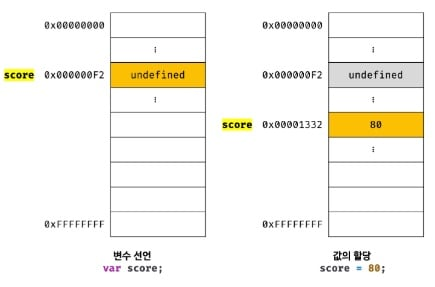
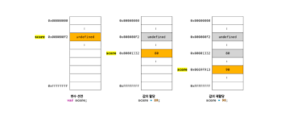

# 메모리(memory)

> 💡 데이터를 저장할 수 있는 메모리 셀(memory cell)의 집합체.

- `메모리 셀 하나의 크기`는 `1바이트(8비트)`이다.
- 컴퓨터는 이 메모리 셀을 `1바이트 단위로 데이터를 저장(write)하거나 읽어(read)`들인다.

<br>


- 각 셀은 `고유의 메모리 주소(memory address)`를 갖는다.
  - 이 주소는 `정수로 표현`되며, 4GB 메모리는 0부터 4,294,967,295(0x00000000 ~ 0xFFFFFFFF)까지의 메모리 주소를 갖는다.
- 컴퓨터는 `모든 데이터를 2진수`로 처리한다.

```
🔎 explanation

만약 사용자가 값을 재사용하고 싶을 땐 메모리 공간에 직접 접근을 해야되지만, 이는 크나큰 문제를 불러 일으킨다.
예를들어, 실수로 운영체제가 사용하고 있는 값을 변경하면 시스템의 치명적인 오류가 발생할 수 있다.
메모리 주소는 동일한 코드를 실행시킨다고 해도 매번 변경되기 때문이다.
이러한 이유로 프로그래밍 언어는 지정된 값을 재사용하기 위해 메모리 주소를 참조하는 변수 매커니즘을 제공한다.
```
<br>

# 변수(variable)란?

> 💡 변수(variable)는 하나의 값을 저장하기 위해 확보한 메모리 공간 자체 또는 그 메모리 공간을 식별하기 위해 붙인 이름을 말한다.

<br>

```js
  10 + 20
```

- 자바스크립트 엔진은 위의 식을 `계산하려면,` 먼저 10, 20, + 라는 `기호(리터럴(literal)과 연산자(operator))의 의미`를 알고 있어야한다.
- 또한, 10 + 20 이라는 `식(표현식(expression))의 의미`도 `해석(파싱(parsing))`할 수 있어야 한다.
- 이는 '+' 연산자의 연산을 수행하기 전 좌변과 우변의 값, `즉 피연산자(operand)를 기억`해야하며, 이러한 모든 기억은
  `CPU를 사용해 연산`하고, `메모리(memory)를 사용해 데이터를 저장`한다.
<br>

```js
  var result = 10 + 20

  // 객체나 배열 같은 자료구조를 사용하면 여러 개의 값을 하나로 그룹화해서 하나의 값처럼 사용할 수 있다.
  var user = { id: 1, name: 'Lee'}

  var users = [
  { id: 1, name: 'Lee' },
  { id: 2, name: 'Kim' }
];
```

- **변수 이름** : 메모리 공간에 저장된 값을 식별할 수 있는 고유한 이름
  - result
- **할당(assignment)** : 변수에 값을 저장하는 것
  - result 변수에 10+20 이 저장
- **참조(reference)** : 변수에 저장된 값을 읽어 들이는 것
  - result 변수를 다른 코드에서 사용할 때
- **선언(declaration)** : 네이밍 규칙을 준수하여, 식별자(변수 이름)의 존재를 알리는 것
  - result

```
🔎 explanation

이러한 변수명을 통해 사람이 이해할 수 있도록 의미를 부여해줄 수 있으며, 가독성을 높이는 부수적인 효과를 제공한다.
```
<br>

# 식별자(identifier)

> 💡 어떤 값을 구별해서 식별할 수 있는 고유한 이름.

- `식별자`는 `변수 이름`이라고도 한다.
<br>


- 식별자는 값이 저장되어 있는 `메모리 주소와 매핑 관계`를 맺으며, `이 매핑 정보도 메모리에 저장`되어야 한다.
  - `메모리 공간에 저장`되어 있는 `어떤 값을 구별`해서 `식별`해 낼 수 있어야 하기 때문.
- 따라서 `식별자는 값이 아니라 메모리 주소`를 기억하고 있다.
  - 식별자 = 메모리 주소에 붙인 이름


```
🔎 explanation

'식별자'라는 용어는 변수 이름에만 국한해서 사용하지 않는다.
예를 들어, 변수, 함수, 클래스 등의 이름은 모두 식별자다.
변수 이름은 메모리 상에 존재하는 변수 값을 식별할 수 있으며, 함수 이름은 메모리 상에 존재하는 함수를 식별할 수 있기 때문이다.
즉 메모리 상에 존재하는 어떤 값을 식별할 수 있는 이름은 모두 식별자라고 부른다.
```
<br>

# 변수 선언(variable declaration)

> 💡 변수 선언이란, 값을 저장하기 위한 메모리 공간을 확보(allocate)하고, 변수 이름과 확보된 메모리 공간의 주소를 연결(name binding)해서
  값을 저장할 수 있게 준비하는 것.

```
🔎 explanation
변수 선언에 의해 확보된 메모리 공간은 확보가 해제(release)되기 전 까지는 누구도 확보된 메모리 공간을 사용할 수 없으며,
이로 인해 안전하게 메모리 공간을 사용할 수 있다.
```
<br>

### _1 변수 선언단계

- 변수를 선언할 때는 `키워드를 사용`한다.
  - 키워드 : var, let, const
  - ES6 에서 let, const 키워드가 도입되기 이전까지 var 키워드만 사용하였다.

```
🔎 explanation

var 키워드에는 여러 단점이 있다.
가장 대표적인 것은 블록 레벨 스코프(block-level scope)를 지원하지 않고, 함수 레벨 스코프(function-level scrope)를 지원한다는 점이다.
이는 의도치 않게 전역 변수가 선언되어 심각한 부작용을 야기한다.
```
<br>

- 변수 선언 이후, 값을 할당하지 않았다면, `메모리 공간`은 절대 값이없이 `비어있지 않는다.`
- 자바스크립트 엔진에 의해 `undefined 값이 할당`되어 `선언 동시에 초기화`된다.
  - undefined = 원시 타입의 값(primitive value)
<br>

### _2 변수 초기화 단계

- **초기화(initialization)** : 변수가 선언된 이후 최초로 값을 할당하는 것
  - 선언 이후 `undefined 가 암묵적으로 자동 할당`이 되므로, `초기화가 자동적으로 진행`되는 것이다.
- 이때, `초기화를 거치지 않으면` 이전 애플리케이션에서 사용했던 값이 남아 참조할 때, `쓰레기 값(garbage value)`이 나올 수도 있다.
  - 자바스크립트는 자동으로 초기화하므로 이런 위험으로 부터 안전하다.

```
🔎 explanation

변수 이름을 비롯한 모든 식별자는 '실행 컨텍스트(execution context)'에 등록된다.
실행 컨텍스트는 JS엔진이 필요한 환경을 제공하고 코드의 실행결과를 실제로 관리하는 영역이다.
또한, 변수 이름과 변수 값은 키(key)/값(value) 형식인 객체로 등록되어 관리된다.
```
<br>

# 변수 선언의 실행 시점과 변수 호이스팅

> 💡 런타임(runtime) : 변수 선언이 소스코드가 한 줄씩 순차적으로 실행되는 시점.

> 💡 변수 호이스팅(variablehoisting) : 변수 선언문이 코드의 선두로 끌어 올려진 것처럼 동작하는 매커니즘

```js
console.log(score); // undefined

var score; // 변수 선언문
```

- 위 코드를 실행시켰을 때 console.log 가 실행되는 시점에서 `⭐참조에러(ReferenceError)가 발생할 것 처럼 보인다.`

```
⭐ explanation

선언하지 않는 식별자에 접근했을 때, 자바스크립트 엔진이 등록된 식별자를 찾을 수 없을 때 발생하는 에러이다.
```

- `그러나` 참조 에러가 발생하지 않고 `undefined 가 출력`될 것이다.
- 그 이유는 자바스크립트 엔진이 한 줄씩 실행하기 앞서, `먼저 소스코드의 평가 과정`을 거치기 때문이다.
  - 이` 평가과정`에서는 변수 선언을 포함한 `모든 선언문`을 `소스코드에서 찾아내 먼저 실행`한다.
- 즉, 자바스크립트 엔진이 `변수 선언이 소스코드의 어디에 있든 상관없이 다른 코드보다 먼저 실행`된다.
  - 따라서, 어디서든지 변수를 참조할 수 있는 것이다.

```
🔎 explanation

사실 변수 선언뿐 아니라,
var, let, const, function, function*, class 키워드를 사용해서 선언하는 모든 식별자는 호이스팅 된다!
```
<br>

### 단, 값을 할당할 때는 달라진다

> 💡 변수 선언 : 런타임 이전에 실행

> 💡 값의 할당 : 런타임에 실행

```js
console.log(score); // undefined

var score; // 1. 변수 선언
score = 80; // 2. 값의 할당

// var score = 80; // 1. + 2. 변수 선언과 값의 할당

console.log(score); // 80
```

- 변수 선언을 하여 undefined 의 값이 할당되어있지만, 위 코드를 보았을 때 `80 의 정수값은 할당되지 않는다.`
- 그 이유는 `변수 선언`이 `런타임 이전에 실행`되며, `값의 할당`이 소스코드가 순차적으로 실행되는 시점인 `런타임에 실행`되기 때문이다.
<br>



- 추가로! `자바스크립트 엔진`은 `변수의 선언과 값의 할당을 2개의 문`으로 나누어 `각각 실행`한다.
- 따라서, 변수에 undefined 가 할당되어 초기화 되는 것은 변함이 없으며,
- `undefined가 저장된 메모리공간을 지우는게 아니라`, `새로운 메모리 공간을 확보`하고 `그곳에 할당 값 80을 저장`한다.
<br>

# 값의 재할당

> 💡 재할당 : 이미 값이 할당되어 있는 변수에 새로운 값을 또다시 할당하는 것
 
```js
var score = 80; // 변수 선언과 값의 할당
score = 90; // 값의 재할당
```

- var 키워드로 선언한 변수는 값을 재할당할 수 있다.
  
```
🔎 explanation

사실 var 키워드로 선언한 변수는 선언과 동시에 undefined로 초기화되기 때문에,
엄밀히 말하자면 변수에 처음으로 값을 할당하는 것도 사실은 재할당이다.
```



- `변수에 값을 재할당`하면, score 변수의 값은 이전 값 80에서 `재할당한 값 90으로 변경`된다.
- 재할당을 할 때도 마찬가지로, `새로운 메모리 공간을 확보`하고 `그 메모리 공간에 숫자 값 90을 저장`한다.
- 그러면 아무도 사용하고 있지 않는 80 과 undefined 의 값은 어디로 갈까?
  - 이러한 불필요 값들은 **⭐가비지 콜렉터(garbage collector)** 에 의해 메모리에서 자동 해제된다.
  
```
⭐ explanation

가비지 콜렉터는 애플리케이션이 할당(allocate)한 메모리 공간을 주기적으로 검사하며,
더이상 사용되지 않는 메모리를 해제(release)하는 기능을 말한다.
더이상 사용되지 않는 메모리 = 어떤 식별자도 참조하지 않는 메모리 공간
자바스크립트는 가비지 콜렉터를 내장하고 있어, 이를 통해 메모리 누수(memory leak)를 방지한다.
```

```
🔎 explanation

상수(constant) : 값을 재할당할 수 없어서 변수에 저장된 값을 변경할 수 없는 것
ES6에서 도입되었으며 const 키워드를 사용해 선언한 변수는 재할당이 금지된다.
```
<br>

# 식별자 네이밍 규칙

> 💡 식별자(identifier) : 어떤 값을 구별해서 식별해낼 수 있는 고유한 이름이며, 네이밍 규칙을 준수해야한다.

**1.** 식별자는 `특수 문자를 제외한 문자, 숫자, 언더스코어(_), 달러 기호($)를 포함`할 수 있다.
<br>
**2.** 단, 식별자는 `특수문제를 제외한 문자, 언더스코어(_), 달러 기호($)로 시작`해야한다. `숫자로 시작하는 것은 허용하지 않는다.`
<br>
**3.** `예약어는 식별자로 사용할 수 없다.`
<br>

|       |       |    예약어 종류    |      |       |       |
|---------|---------|--------|---------|---------|---------|
|await    |break    |case    |catch    |class    |const    |
|continue |debugger |default |delete   | do      |else     |
|enum     |export   |extends |flase    |finally  |for      |
|function |if       |implements* |import   |in  |instanceof|
|interface* |let*   |new     |null     |package* |private* |
|protected* |public*|return  |super    |static*  |switch   |
|this     |thorw    |true    |try      | typeof  |var      |
|void     |while    |with    |yield*   |         |         |

           * 식별자로 사용 가능하나 strict mode에서는 사용 불가


- **네이밍 컨벤션(naming convention)**

```js
// 카멜 케이스(camelCase)
var firstName;

// 스네이크 케이스(snake_case)
var first_name;

// 파스칼 케이스(PascalCase)
var FirstName;

// 헝가리언 케이스(typeHungarianCase)
var strFistName; // type + identifier
var $elem = document.getElementByid('myId'); // DOM 노드
var observable$ = fromEvent(document, 'click')' // RxJS 옵저버블
```

- `가독성 좋게` 단어를 한눈에 구분하기 위해 규정한 명명규칙이며,
- 일반적으로 `변수나 함수의 이름에는 카멜 케이스`를 사용하고,
- `생성자 함수, 클래스의 이름에는 파스칼 케이스`를 사용한다.

```
🔎 explanation

ECMAScript 사양에 정의되어 있는 객체와 함수들도 카멜 케이스와 파스칼 케이스를 사용한다.
따라서 코드 전체의 가독성을 높이려면 카멜 케이스와 파스칼 케이스를 따르는 것이 유리하다.
```


