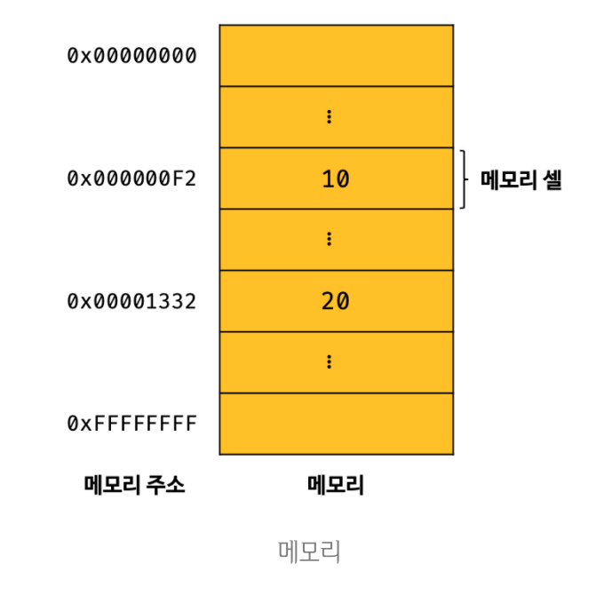
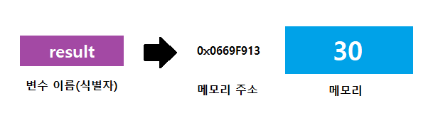

# 메모리(memory)

> 💡 데이터를 저장할 수 있는 메모리 셀(memory cell)의 집합체.

- 메모리 셀 하나의 크기는 1바이트(8비트)이다.
- 컴퓨터는 이 메모리 셀을 1바이트 단위로 데이터를 저장(write)하거나 읽어(read)들인다.

<br>



- 각 셀은 `고유의 메모리 주소(memory address)`를 갖는다.
  - 이 주소는 `정수로 표현`되며, 4GB 메모리는 0부터 4,294,967,295(0x00000000 ~ 0xFFFFFFFF)까지의 메모리 주소를 갖는다.
- 컴퓨터는 `모든 데이터를 2진수`로 처리한다.

```
🔎 explanation

만약 사용자가 값을 재사용하고 싶을 땐 메모리 공간에 직접 접근을 해야되지만, 이는 크나큰 문제를 불러 일으킨다.
예를들어, 실수로 운영체제가 사용하고 있는 값을 변경하면 시스템의 치명적인 오류가 발생할 수 있다.
메모리 주소는 동일한 코드를 실행시킨다고 해도 매번 변경되기 때문이다.
이러한 이유로 프로그래밍 언어는 지정된 값을 재사용하기 위해 메모리 주소를 참조하는 변수 매커니즘을 제공한다.
```
<br>

# 변수(variable)란?

> 💡 변수(variable)는 하나의 값을 저장하기 위해 확보한 메모리 공간 자체 또는 그 메모리 공간을 식별하기 위해 붙인 이름을 말한다.

<br>

```js
  10 + 20
```

- 자바스크립트 엔진은 위의 식을 `계산하려면,` 먼저 10, 20, + 라는 `기호(리터럴(literal)과 연산자(operator))의 의미`를 알고 있어야한다.
- 또한, 10 + 20 이라는 `식(표현식(expression))의 의미`도 `해석(파싱(parsing))`할 수 있어야 한다.
- 이는 '+' 연산자의 연산을 수행하기 전 좌변과 우변의 값, `즉 피연산자(operand)를 기억`해야하며, 이러한 모든 기억은
  `CPU를 사용해 연산`하고, `메모리(memory)를 사용해 데이터를 저장`한다.
<br>

```js
  var result = 10 + 20

  // 객체나 배열 같은 자료구조를 사용하면 여러 개의 값을 하나로 그룹화해서 하나의 값처럼 사용할 수 있다.
  var user = { id: 1, name: 'Lee'}

  var users = [
  { id: 1, name: 'Lee' },
  { id: 2, name: 'Kim' }
];
```

- **변수 이름** : 메모리 공간에 저장된 값을 식별할 수 있는 고유한 이름
  - result
- **할당(assignment)** : 변수에 값을 저장하는 것
  - result 변수에 10+20 이 저장
- **참조(reference)** : 변수에 저장된 값을 읽어 들이는 것
  - result 변수를 다른 코드에서 사용할 때
- **선언(declaration)** : 네이밍 규칙을 준수하여, 식별자(변수 이름)의 존재를 알리는 것
  - result

```
🔎 explanation

이러한 변수명을 통해 사람이 이해할 수 있도록 의미를 부여해줄 수 있으며, 가독성을 높이는 부수적인 효과를 제공한다.
```
<br>

# 식별자(identifier)

> 💡 어떤 값을 구별해서 식별할 수 있는 고유한 이름.

- `식별자`는 `변수 이름`이라고도 한다.
<br>



- 식별자는 값이 저장되어 있는 `메모리 주소와 매핑 관계`를 맺으며, `이 매핑 정보도 메모리에 저장`되어야 한다.
  - `메모리 공간에 저장`되어 있는 `어떤 값을 구별`해서 `식별`해 낼 수 있어야 하기 때문.
- 따라서 `식별자는 값이 아니라 메모리 주소`를 기억하고 있다.
  - 식별자 = 메모리 주소에 붙인 이름


```
🔎 explanation

'식별자'라는 용어는 변수 이름에만 국한해서 사용하지 않는다.
예를 들어, 변수, 함수, 클래스 등의 이름은 모두 식별자다.
변수 이름은 메모리 상에 존재하는 변수 값을 식별할 수 있으며, 함수 이름은 메모리 상에 존재하는 함수를 식별할 수 있기 때문이다.
즉 메모리 상에 존재하는 어떤 값을 식별할 수 있는 이름은 모두 식별자라고 부른다.
```
<br>

# 변수 선언(variable declaration)

> 💡 변수 선언이란, 값을 저장하기 위한 메모리 공간을 확보(allocate)하고, 변수 이름과 확보된 메모리 공간의 주소를 연결(name binding)해서
  값을 저장할 수 있게 준비하는 것.

```
🔎 explanation
변수 선언에 의해 확보된 메모리 공간은 확보가 해제(release)되기 전 까지는 누구도 확보된 메모리 공간을 사용할 수 없으며,
이로 인해 안전하게 메모리 공간을 사용할 수 있다.
```
<br>

### _1 변수 선언단계

- 변수를 선언할 때는 `키워드를 사용`한다.
  - var, let, const
  - ES6 에서 let, const 키워드가 도입되기 이전까지 var 키워드만 사용하였다.

```
🔎 explanation

var 키워드에는 여러 단점이 있다.
가장 대표적인 것은 블록 레벨 스코프(block-level scope)를 지원하지 않고, 함수 레벨 스코프(function-level scrope)를 지원한다는 점이다.
이는 의도치 않게 전역 변수가 선언되어 심각한 부작용을 야기한다.
```
<br>

- 변수 선언 이후, 값을 할당하지 않았다면, `메모리 공간`은 절대 값이없이 `비어있지 않는다.`
- 자바스크립트 엔진에 의해 `undefined 값이 할당`되어 `선언 동시에 초기화`된다.
  - undefined = 원시 타입의 값(primitive value)
<br>

### _2 변수 초기화 단계

- **초기화(initialization)** : 변수가 선언된 이후 최초로 값을 할당하는 것
  - 선언 이후 `undefined 가 암묵적으로 자동 할당`이 되므로, `초기화가 자동적으로 진행`되는 것이다.
- 이때, `초기화를 거치지 않으면` 이전 애플리케이션에서 사용했던 값이 남아 참조할 때, `쓰레기 값(garbage value)`가 나올 수도 있다.
  - 자바스크립트는 자동으로 초기화하므로 이런 위험으로 부터 안전하다.
<br>

```
🔎 explanation

변수 이름을 비롯한 모든 식별자는 '실행 컨텍스트(execution context)'에 등록된다.
실행 컨텍스트는 JS엔진이 필요한 환경을 제공하고 코드의 실행결과를 실제로 관리하는 영역이다.
또한, 변수 이름과 변수 값은 키(key)/값(value) 형식인 객체로 등록되어 관리된다.
```
