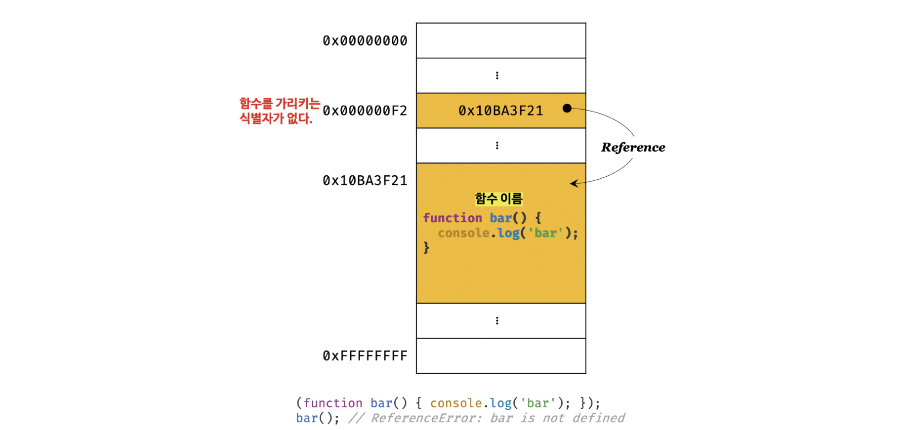
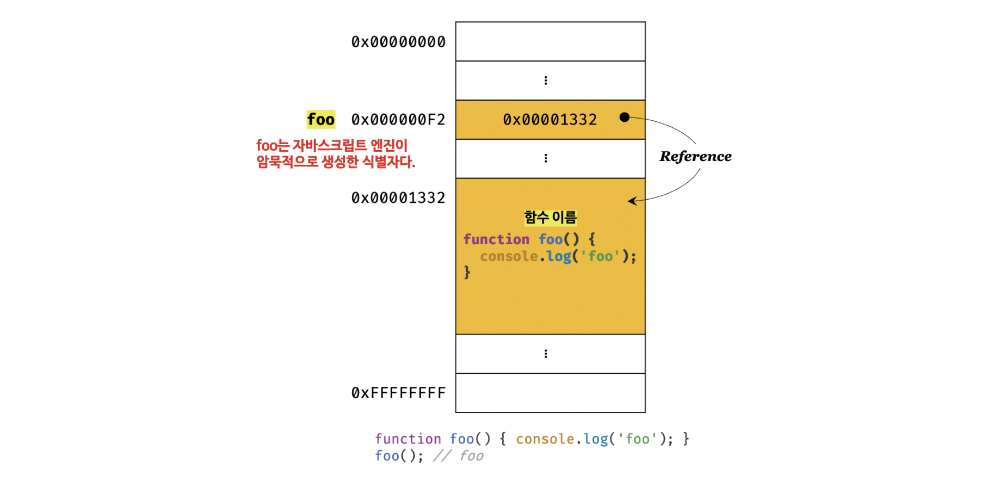

# 함수란?

> 💡 함수는 일련의 과정을 문(statement)으로 구현하고 코드 블록으로 감싸서 하나의 실행 단위로 정의한 것.
>> 함수는 매개변수(parameter), 인수(argument), 반환값(return value)을 가진다.
<br>

```js

// 함수 정의
function add(x, y) {  // add → 함수이름, (x,y) → 매개 변수
  return x + y;       // x + y → 반환값                        // → 함수 정의(함수 몸체)
}
add(2,5);             // (2,5) → 인수                          // → 함수 호출

// 함수 호출
var result = add(2,5);

// 함수 add에 인수 2, 5를 전달하면서 호출하면 반환값 7을 반환한다.
console.log(result);

```

- 함수는 함수 정의(function definition)를 통해 생성한다.
  
- 또한, 인수(argument)를 매개변수를 통해 함수에 전달하면서 함수의 실행을 명시적으로 지시해야한다.
  - 이를 함수 호출(function call/invoke)이라 한다.
<br>

```js
🔎 Note

[함수를 사용하는 이유]

1️⃣ 함수는 몇 번이든 호출할 수 있으므로 "코드의 재사용"이라는 측면에서 유용
2️⃣ 코드 중복을 억제하고 재사용성을 높이는 함수로 "유지보수의 편의성"을 높임
3️⃣ 실수를 줄여 "코드의 신뢰성"을 높임
4️⃣ 적절한 함수의 이름을 통해 그 역할을 이해할 수 있도록 도움으로서, "코드의 가독성 향상"
```
<br>

# 함수 리터럴

> 💡 `함수는 객체 타입의 값`이다.
>> 이는 숫자 값을 숫자 리터럴로 생성하고 객체를 객체 리터럴로 생성하는 것처럼 `함수도 함수 리터럴로 생성`할 수 있다.
<br>

```js

// 변수에 함수 리터럴을 할당
var f = function add(x,y) {
  return x + y;
};

```

- 리터럴은 값을 생성하기 위한 표기법이다.

  - 따라서, 함수 리터럴도 평가되어 값을 생성하므로 이 값은 객체 즉, **함수는 객체**다
<br>

```js
🔎 Note

[함수와 일반 객체]

함수는 객체지만 일반 객체와는 차이점을 보인다.

1️⃣ 일반 객체는 호출할 수 없지만 "함수는 호출"할 수 있다.
2️⃣ 일반 객체에는 없는 "함수 객체만의 고유한 프로퍼티"를 갖는다.

이는 자바스크립트의 주요 특징이며, 함수를 제대로 이해하기 위한 첫 디딤발이다.
```
<br>

# 함수 정의

> 💡  `함수 정의` : 함수를 호출하기 이전에 인수를 전달받을 매개변수와 실행할 문들, 그리고 반환할 값을 지정하는 것
>> 정의된 함수는 자바스크립트 엔진에 의해 평가되어 함수 객체가 된다.

>> 또한, 자바스크립트에서 함수를 정의하는 방식은 4가지가 있다.
<br>

## 1️⃣  함수 선언문

> 함수 선언문을 사용해 함수를 정의하는 방식은 다음과 같다.

```js

// 함수 선언문
function add(x, y) {
  return x + y;
}

// 함수 호출
// console.log(add(2, 5)); // 7

// 함수 리터럴은 함수 이름을 생략할 수 있으나
// 함수 선언문은 함수 이름을 생략할 수 없다!
function (x, y) {
  return x + y;
}
// SyntaxError: Function statements require a function name
```
<br>

- **함수 선언문은 표현식이 아닌 문**이다.
  - 만약 표현식인 문이라면 완료 값 undefined 대신 표현식이 평가되어 생성된 함수가 출력되어야 한다.

```js

function add(x, y) {
  return x + y;
}
// undefined

```
<br>

### 변수에 할당되는 함수 선언문??
<br>

> 표현식이 아닌 문은 변수에 할당할 수 없다!
>> 그러나 표현식이 아닌 함수 선언문도 변수에 할당할 수 없을까?
<br>

```js

var add = function add(x, y) {
  return x + y;
};

// 함수 호출
console.log(add(2, 5)); // 7

```

- `함수 선언문은 표현식이 아닌 문이므로 변수에 할당할 수 없다.`
- 하지만 `함수 선언문이 변수에 할당되는 것 처럼 보인다.`
  - 이는 왜 그런 것인가?
<br>

```js
🔎 Note

[변수에 할당되는 것 처럼 동작하는 이유]

이는 자바스크립트 엔진이 코드의 문맥에 따라 해석하는 방향이 다르기 때문이다.

1️⃣ 표현식이 아닌 문인 "함수 선언문으로 해석"하는 경우
2️⃣ 표현식인 문인 "함수 리터럴 표현식으로 해석"하는 경우


[대체 이게 뭔 소리야?]

예를 들어, "{}은 블록문일 수도 있고 객체 리터럴 일 수도 있는 것"과 같이
"자바스크립트 엔진"은 {}처럼 중의적인 코드를 "코드의 문맥에 따라 맞춰 해석"해버린다.

{}이 단독으로 존재하면 블록문으로 해석하고,
{}이 피연산자로 사용되면 객체 리터럴로 해석하는 것 처럼 말이다.


[결론!]

1️⃣ 함수 리터럴을 "피연산자로 사용하지 않은 경우 함수 선언문으로" 해석
2️⃣ 함수 리터럴을 "변수에 할당하거나 피연산자로 사용하면 함수 리터럴 표현식으로" 해석
```
<br>

### 함수 선언문과 함수 리터럴 표현식의 차이점
<br>

> 함수 리터럴을 피연산자로 사용했을 때

```js

(function bar() { console.log('bar'); });
// 함수 리터럴 표현식으로 해석되며,
// 함수 선언문이 아니므로 함수 이름을 생략할 수 있다.
bar(); // ReferenceError: bar is not defined

```

- `함수 리터럴 표현식으로 생성된 bar는 호출할 수 없다.`
  - 함수 몸체 외부에서 함수 이름으로 함수를 참조할 수 없으므로 함수 몸체 외부에서는 함수 이름으로 함수를 호출할 수 없다
  - 즉, **함수를 가리키는 식별자가 없다**는 것이다.


<br>

> 기명 함수 리터럴을 단독으로 사용했을 때

```js

function foo() { console.log('foo'); }
// 함수 선언문으로 해석되며,
// 함수 선언문이므로 함수 이름을 생략할 수 없다.
foo(); // foo

```

- 함수 리터럴 표현식으로 생성된 함수와 달리 `함수 선언문으로 생성된 foo는 호출할 수 있다.`
  - foo는 **자바스크립트 엔진이 암묵적으로 생성한 식별자**이기 때문에 호출할 수 있는 것이다.
<br>



- 생성된 함수를 호출하기 위해 함수 이름과 **동일한 이름의 식별자를 암묵적으로 생성**하는 것이며, **함수 객체를 할당**한다.
  - 함수 객체를 가리키는 `식별자가 없으면 생성된 함수 객체를 참조할 수 없어, 호출할 수도 없기 때문`이다.
<br>

```js

🔎 Note

함수는 함수 이름으로 호출하는 것이 아닌 "함수 객체를 가리키는 식별자로 호출"한다!

var add = function add(x, y) {    // add → 식별자, add → 함수 이름 
  return x + y;
};

console.log(add(2, 5)); // 7      // add → 식별자

```
<br>

## 2️⃣ 함수 표현식

> 💡 `함수 표현식(function expression)` : `함수는 일급 객체`이므로
함수 리터럴로 생성한 함수 객체를 변수에 할당할 수 있는 정의 방식
>> `일급 객체` : 함수는 값처럼 변수에 할당할 수도 있고 프로퍼티 값이, 배열의 요소가 될 수 있다.
이처럼 `값의 성질을 가질 때` 일급 객체라 한다.
<br>

```js

var add = function foo (x, y) {
  return x = y;
};

// 함수 객체를 가리키는 식별자로 호출
console.log(add(2, 5)); // 7

// 함수 이름으로 호출하면 ReferenceError가 발생한다.
// 함수 이름은 함수 몸체 내부에서만 유효한 식별자이기 때문이다.
console.log(foo(2, 5)); // ReferenceError: foo is not defined

```
<br>

⭐️ 함수 선언문 → "표현식이 아닌 문" & 함수 표현식 → "표현식인 문"
<br>

### 함수 선언문과 함수 표현식의 차이점
<br>

## 3️⃣ Function 생성자 함수
<br>

## 4️⃣ 화살표 함수
<br>

# 함수 호출
<br>

# 참조에 의한 전달과 외부 상태의 변경
<br>

# 다양한 함수의 형태
<br>
