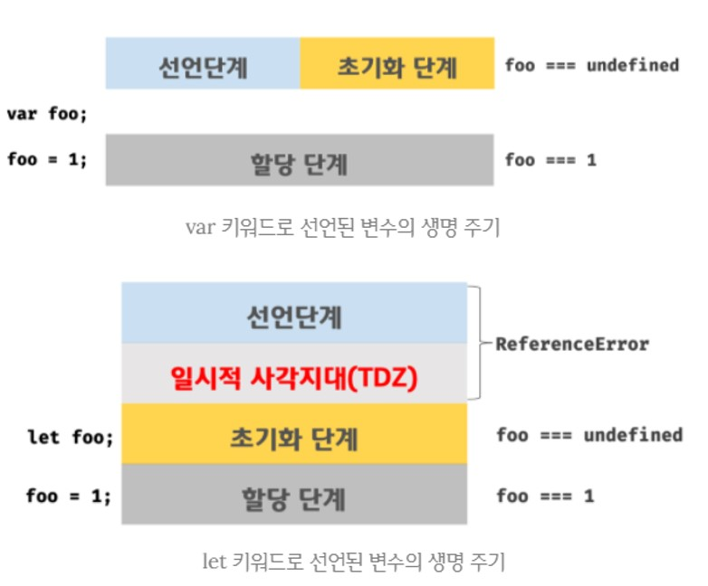

```js
🔎 Note

[var 키워드로 선언한 변수의 문제점]

1️⃣ "변수 중복 선언 허용"

- 초기화문(변수 선언과 동시에 초기값을 할당하는 문)이 있는 경우,
  의도치 않게 먼저 선언된 변수 값이 변경되는 부작용이 발생할 수 있다.

2️⃣ "함수 레벨 스코프"

- var 키워드로 선언한 변수는 "오로지 함수의 코드 블록만을 지역 스코프로 인정"한다.
  때문에, 함수 내부가 아니라면 var 키워드로 변수를 선언해도 모두 전역 변수가 된다.

3️⃣ "변수 호이스팅"

- 변수 선언문이 스코프의 선두로 끌어 올려진 것 처럼 동작
  때문에, 가독성을 떨어뜨리고 오류를 발생시킬 여지를 남긴다.


! 이 때문에 ES6 에서 새로운 변수 선언 키워드인 "let"과 "const"를 도입했다.
```
<br>

# let 키워드

## 1️⃣ 변수 중복 선언 금지

> `let 키워드`로 이름이 같은 변수를 `중복 선언하면 문법 에러(SyntaxError)가 발생.`
>> 변수 값이 재할당되어 변경되는 부작용을 방지시켜준다.
<br>

```js

let bar = 123;
// let이나 const 키워드로 선언된 변수는 같은 스코프 내에서 중복 선언을 허용하지 않는다.
let bar = 456; // SyntaxError: Identifier 'bar' has already been declared

```
<br>

## 2️⃣ 블록 레벨 스코프

> let 키워드로 선언한 변수는 `모든 코드 블록을 지역 스코프로 인정`하는 `블록 레벨 스코프(block-level scope)`를 따른다.
>> 함수, if문, for문, while문, try/catch 문 등,,
<br>

```js

let foo = 1; // 전역 변수

{
  let foo = 2; // 지역 변수
  let bar = 3; // 지역 변수
}

console.log(foo); // 1
console.log(bar); // ReferenceError: bar is not  defined

```
<br>

## 3️⃣ 변수 호이스팅

> `let 키워드`로 선언한 변수는 `변수 호이스팅이 발생하지 않는 것처럼 동작`한다.
>> 변수 선언문 이전에 참조시, 참조 에러(ReeferenceError)가 발생
<br>

```js
🔎 Note

[변수 호이스팅이 발생하지 '않는 것 처럼'??]

var 키워드로 선언한 변수는 런타임 이전에 자바스크립트 엔진에 의해 암묵적으로
"선언 단계"와 "초기화 단계"가 한번에 진행된다.


그러나 let 키워드로 선언한 변수는 "선언 단계"와 "초기화 단계"가 분리되어 진행된다.

즉, 런타임 이전에 자바스크립트 엔진에 의해 암묵적으로 선언 단계가 먼저 실행되지만
초기화 단게는 변수 선언문에 도달했을 때 실행 된다.

만약 초기화 단계가 실행되기 이전에 변수에 접근하려고 하면 참조 에러(Reference Error)가 발생한다.
! 이 지점을 "일시적 사각지대(Temporal Dead Zone; TDZ)"라고 부른다
```
<br>

```js

// [var 키워드]
// var 키워드로 선언한 변수는 런타임 이전에 선언 단계와 초기화 단계가 실행된다.
// 따라서 변수 선언문 이전에 변수를 참조할 수 있다.
console.log(foo); // undefined

var foo;
console.log(foo); // undefined

foo = 1; // 할당문에서 할당 단계가 실행된다.
console.log(foo); // 1


// [let 키워드]
// 런타임 이전에 선언 단계가 실행된다. 아직 변수가 초기화 되지 않았다.
// 초기화 이전의 일시적 사각지대에서는 변수를 참조할 수 없다.
console.log(foo); // ReferenceError: foo is not defined

let foo; // 변수 선언문에서 초기화 단계가 실행된다.
console.log(foo); // undefined

foo = 1; // 할당문에서 할당 단계가 실행된다.
console.log(foo); // 1

```

<br>

## 4️⃣ 전역 객체와 let

> `let 키워드`로 선언한 전역 변수는 `전역 객체의 프로퍼티가 아니다.`
>> var 키워드로 선언한 전역 변수와 전역 함수, 암묵적 전역은 전역 객체 window의 프로퍼티가 된다.
<br>

```js

// [var 키워드]
// 전역 변수
var x = 1;
// 암묵적 전역
y = 2;
// 전역 함수
function foo() {}

// var 키워드로 선언한 전역 변수는 전역 객체 window의 프로퍼티다.
console.log(window.x); // 1
// 전역 객체 window의 프로퍼티는 전역 변수처럼 사용할 수 있다.
console.log(x); // 1


// [let 키워드]
let x = 1;

// let, const 키워드로 선언한 전역 변수는 전역 객체 window의 프로퍼티가 아니다.
console.log(window.x); // undefined
console.log(x); // 1

```
<br>

# const 키워드

> 💡 `const 키워드`는 `상수(constant)를 선언하기 위해 사용`한다.
>> 그러나 반드시 상수만을 위해 사용하지는 않는다.

> 💡 `const 키워드의 특징은 let 키워드와 대부분 동일`하다.
>> 블록 레벨 스코프, 변수 호이스팅이 발생하지 않는 것 처럼 동작
<br>

## 1️⃣ 선언과 초기화

> `const 키워드`로 선언한 변수는 반드시 `선언과 동시에 초기화`해야 한다.
<br>

```js

const foo = 1;

// 그렇지 않으면 문법 에러가 발생한다.
const foo; // SyntaxError: Missing initializer in const declaration

```
<br>

## 2️⃣ 재할당 금지

> `const 키워드로 선언한 변수는 재할당이 금지`된다.
>> var 또는 let 키워드로 선언한 변수는 재할당이 자유롭다.
<br>

```js

const foo = 1;
foo = 2; // TypeError: Assignment to constant variable.

```
<br>

## 3️⃣ 상수

> `상수` : 재할당이 금지된 변수
>> 상수도 값을 저장하기 위한 메모리 공간이 필요하므로 변수라고 할 수 있다.
<br>

### 상수에 원시 값을 할당했을 때

> `const 키워드`에 의해 `재할당이 금지`되므로 할당된 값을 변경할 수 없다.
>> 원시 값은 `변경할 수 없는 값(immutable value)`이기 때문이다.
<br>

```js

// 일반적으로 상수 이름은 대문자로 선언한다.
// 변수 이름을 대문자로 선언해 상수임을 명확히 나타낸다.
const TAX_RATE = 0.1;

let preTaxPrice = 100;

let afterTaxPrice = preTaxPrice + (preTaxPrice * TAX_RATE);

console.log(afterTaxPrice); // 110

```
<br>

### 상수에 객체를 할당 했을 때

> `const 키워드`로 선언된 변수에 `객체를 할당한 경우 값을 변경`할 수 있다.
>> `객체는 재할당 없이도 직접 변경이 가능하기 때문`이다.
<br>

```js

const person = {
  name: 'Lee'
};

// 객체는 변경 가능한 값이다. 따라서 재할당 없이 변경이 가능하다.
person.name = 'Kim';

console.log(person); // {name: "Kim"}

```

- **const 키워드는 재할당을 금지할 뿐 "불변"을 의미하지는 않는다.**
  - 객체가 변경되더라도, 변수에 할당된 참조 값은 변경되지 않는다.
